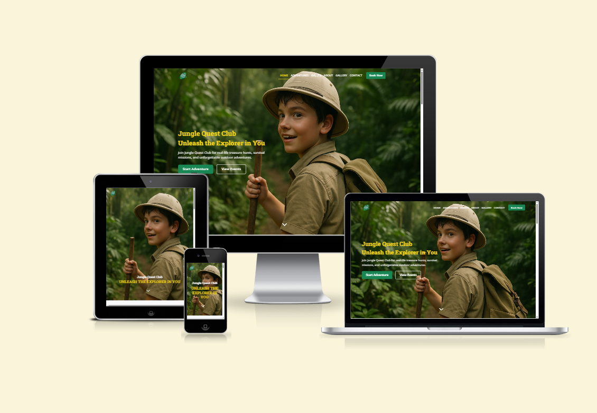
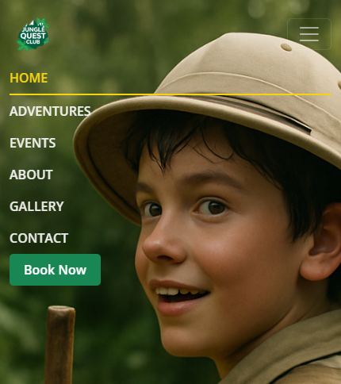
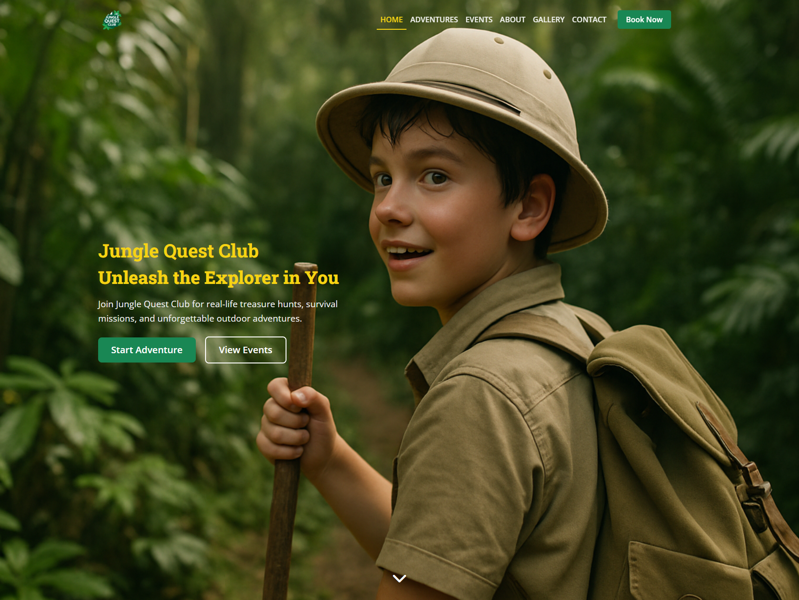
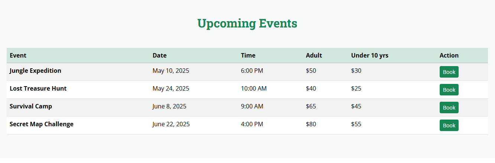
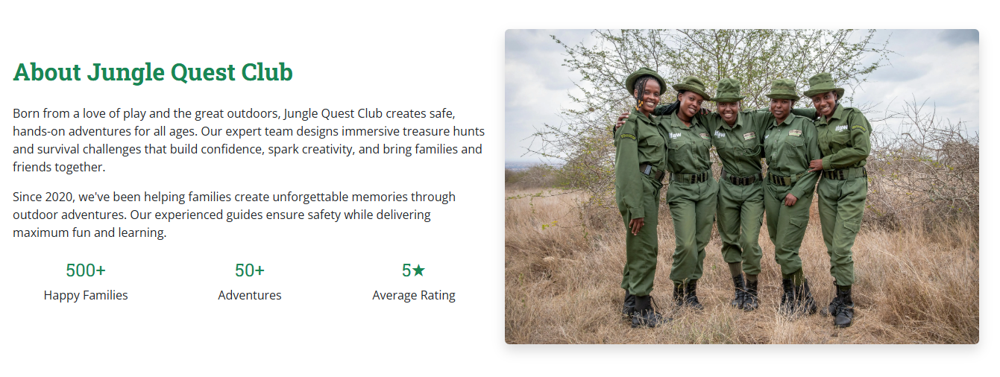
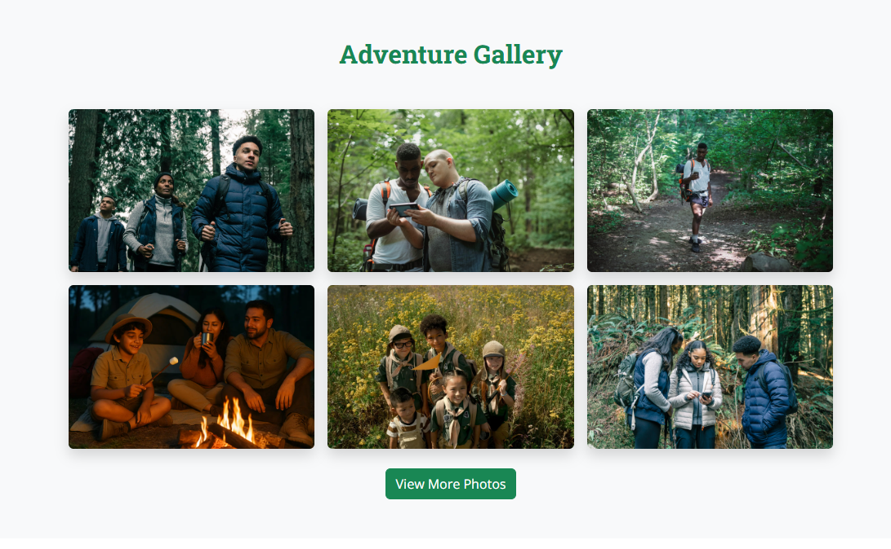
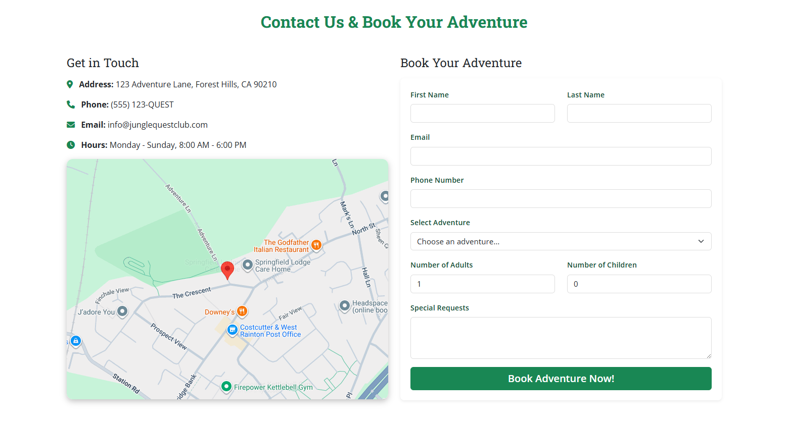
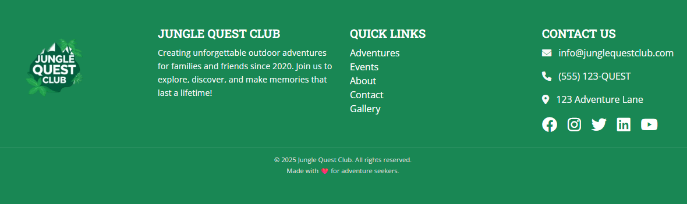
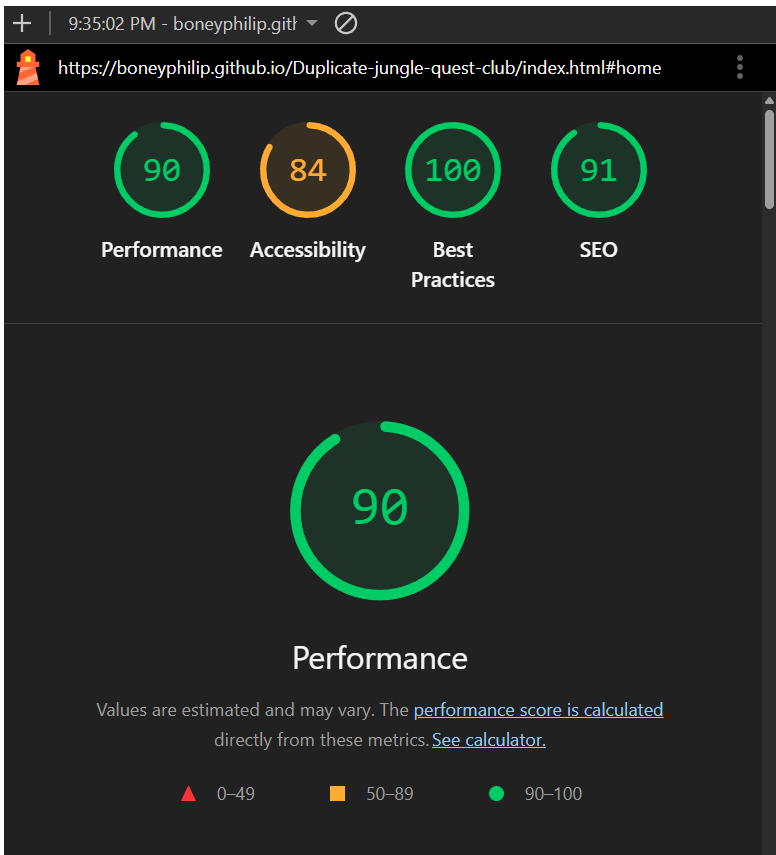

🌿 Jungle Quest Club

  

🎯 Overview

Jungle Quest Club is a responsive website designed to showcase thrilling outdoor adventures, from treasure hunts to survival camps and night treks.

It allows families, kids, and adventure-seekers to explore activities, view upcoming events, browse past adventure galleries, and book experiences directly online.

The project’s aim is to:

  - Create excitement for outdoor exploration.

  - Provide clear event and pricing details.

  - Offer an easy booking process.

  - Build trust through testimonials, photos, and professional presentation.

Target Audience:

   - Families looking for unique bonding activities.

   - Kids eager to explore nature safely.

   - Groups of friends or clubs seeking adventurous outings.

  
  

✨ Features
 
 Navigation Bar

 - Present across all pages.

 - Links: Home, Adventures, Events, About, Gallery, Contact, Book Now.

 - Jungle yellow highlight on the active link.

 - Hamburger menu for mobile devices.

 - Value: Users can easily find their way around, on any screen size.

   

   

🏕️ Hero Section

- Full-width jungle-themed background image.

- Eye-catching heading: “Jungle Quest Club – Unleash the Explorer in You”.

- Buttons: Start Adventure and View Events.

- Animated scroll-down arrow at the bottom.

- Value: Instantly grabs attention and encourages exploration.

🗺️ Adventures Section

- Displays three adventure offerings:

  1. Treasure Hunt Quest 🗝️

  2. Survival Skills Camp 🔥

  3. Night Trek Challenge 🌙

- Each with images, short descriptions, and starting prices.

- Value: Gives a quick overview of what’s available.

📅 Events Section

- Upcoming events in a table format.

- Clear details: Event name, date, time, adult/child price, Book button.

- Buttons link directly to the booking form.

- Value: Users can instantly see what’s on and book.

🌳 About Section

- Explains the mission and story of Jungle Quest Club.

- Stats highlight credibility:

  - 500+ Happy Families

  - 50+ Adventures

  - 5★ Average Rating

- Accompanied by an image.

- Value: Builds trust and community feeling.

📸 Gallery Section

 - Six preview images in a responsive grid.

 - Rounded corners and shadows for polished look.

 - View More Photos button links to dedicated gallery page.

 - Value: Showcases real experiences, helping users imagine themselves joining.

  

✉️ Contact & Booking Section

- Two-column layout:

  - Left: Address, phone, email, opening hours, and Google map.

  - Right: Booking form for adventures.

- Form fields: name, email, phone, participants, adventure type, requests.

- Value: Provides a direct and easy booking system.

🔻 Footer

- Four-column layout:

  - Logo (links to homepage).

  - About summary.

  - Quick links.

  - Contact + social media icons.

- Social icons open in new tab.

- Value: Keeps important info at the bottom of every page.

📖 Gallery Page (Standalone)

- Custom hero image with heading: Adventure Gallery.

- Extended photo grid for more exploration.

- Consistent navbar & footer.

- Value: Acts as a visual memory bank of past events.

🛠️ Features Left to Implement

- Lightbox popups for gallery images.

= User accounts for managing bookings.

= Interactive event calendar with availability.

✅ Testing
Manual Testing

- All links navigate correctly.

- Navbar underline correctly highlights active page.

- Buttons scroll to the right section.

- Booking form validates required fields.

- Site tested on Chrome, Firefox, Edge, Safari.

Validator Testing

HTML: Passed through W3C Validator
 with no errors.

CSS: Passed through Jigsaw Validator
 with no errors.

📸 Screenshot Placeholder – Validation Results

Lighthouse Performance

- Performance: ~90+

- Accessibility: ~95+

- Best Practices: ~100

- SEO: ~100

🐛 Known Bugs

- On very small screens (<320px), hero text may overlap.

- Booking form doesn’t send data to email yet (just placeholder endpoint).

🚀 Deployment

The site was deployed to GitHub Pages:

  1. Navigate to repository → Settings.

  2. Under Pages, select main branch.

  3. Site automatically published.

🔗 Live Link: [Jungle Quest Club](https://boneyphilip.github.io/Duplicate-jungle-quest-club/index.html#contact)

📸 Credits
Content

- Text written by project author (me).

- Layout structure inspired by Code Institute’s Love Running project.

Media

- Images sourced from Pexels and custom WebP exports.

- Icons provided by Font Awesome.# Jungle Quest Club

             
## Tools & Tech
- HTML5, CSS3  
- Bootstrap 5  
- Google Fonts (Open Sans, Roboto Slab)  
- Font Awesome icons  
- Git & GitHub (version control + GitHub Pages)   

## Site Owner’s Goal
To inspire more people to step outside, learn practical outdoor skills, and make lasting memories—demonstrating that adventure isn’t just a vacation, it’s a way of life.

## Responsiveness Testing
- Chrome DevTools (mobile, tablet, desktop)  
- Real devices: iPhone, Android phone, iPad, various desktop monitors  

| Feature             | Action Tested                             | Expected Result                         | Actual Result     | Pass/Fail |
| ------------------- | ----------------------------------------- | --------------------------------------- | ----------------- | --------- |
| Navbar links        | Click links (Home, Gallery, Contact)      | Smooth scroll / Redirect works          | Works as expected | ✅ Pass    |
| Navbar highlight    | Scroll through sections                   | Yellow underline moves correctly        | Works as expected | ✅ Pass    |
| Hero buttons        | Click “Start Adventure” and “View Events” | Scrolls to correct section              | Works as expected | ✅ Pass    |
| Scroll Arrow        | Click arrow in hero section               | Moves to next section                   | Works as expected | ✅ Pass    |
| Events table “Book” | Click button                              | Scrolls to booking form                 | Works as expected | ✅ Pass    |
| Contact form        | Submit empty fields                       | Error shown (required fields)           | Works as expected | ✅ Pass    |
| Contact form        | Submit with valid data                    | Redirects to form handler (CI formdump) | Works as expected | ✅ Pass    |
| Responsiveness      | Check on mobile/tablet/desktop            | Layout adjusts, images resize properly  | Works as expected | ✅ Pass    |
| Gallery images      | Verify loading and responsiveness         | Display in grid properly         | Works as expected | ✅ Pass    |

## Known Bugs
- Minor flicker on hero image load in low-bandwidth conditions  
- Edge case: lengthy “Special Requests” in form can push layout slightly  

---

**Enjoy building and happy adventuring!**  
Jungle Quest Club – Where every trail tells a story.

